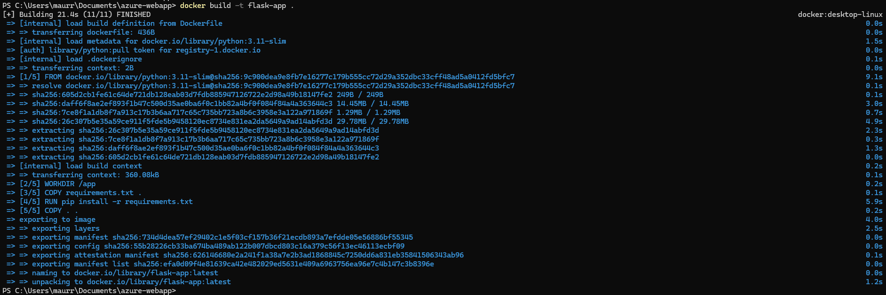
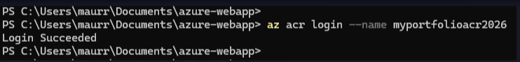
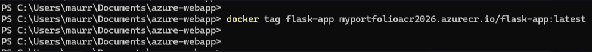
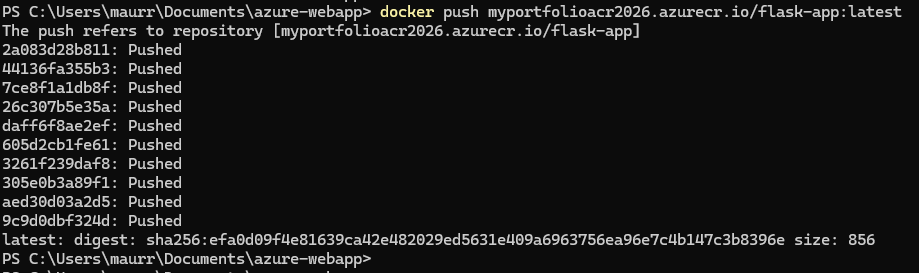
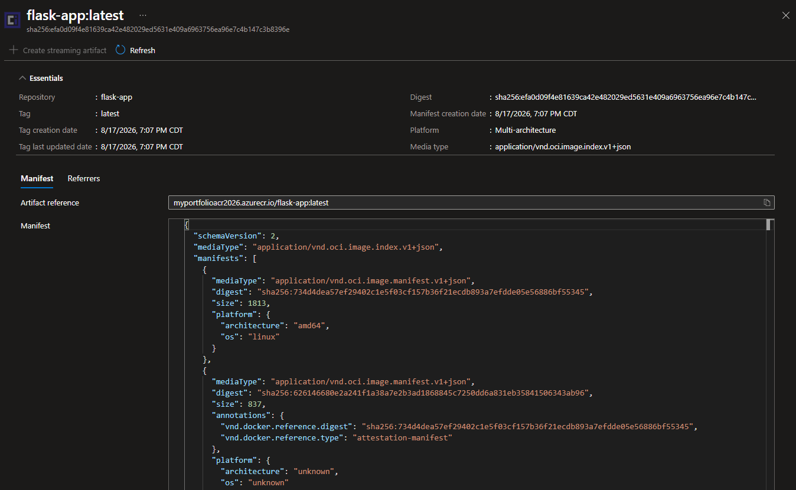
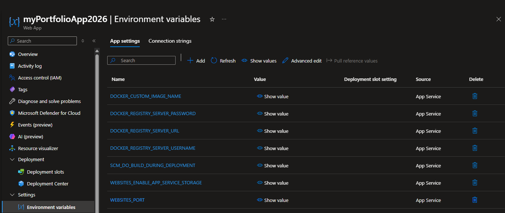
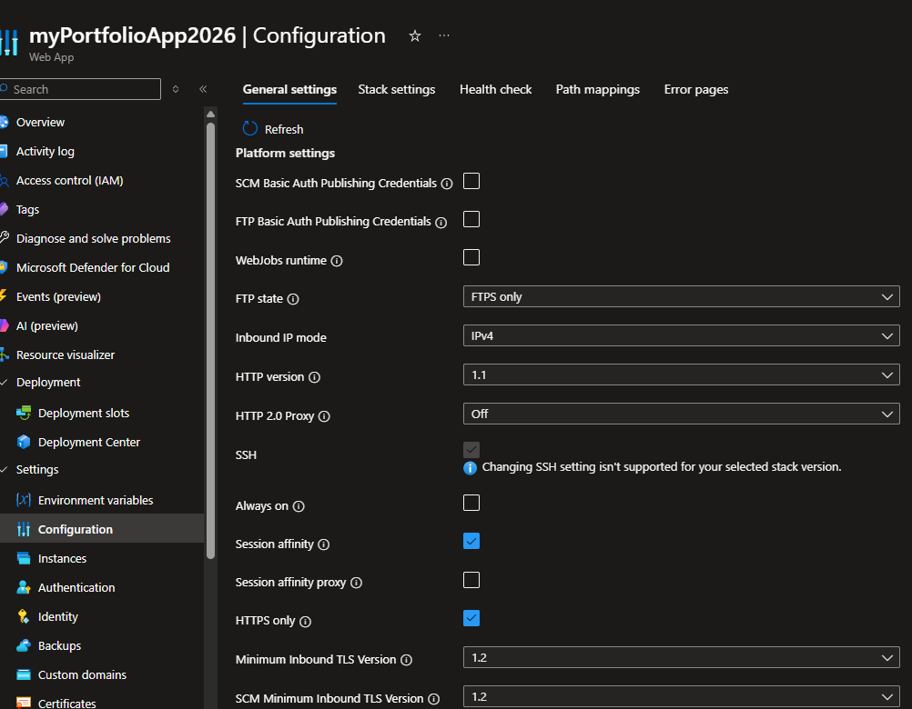
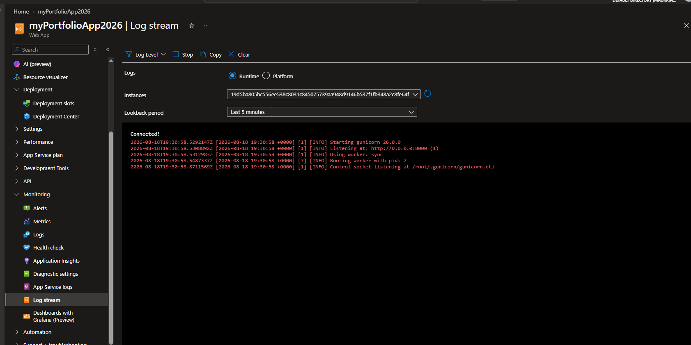

## 1. Build the Image
```bash
docker build -t flask-app .
```
**Docker Build**


## 2. Log In to Azure Container Registry
```bash
az acr login --name myportfolioacr2026
```
**ACR Login**


## 3. Tag the Image
```bash
docker tag flask-app myportfolioacr2026.azurecr.io/flask-app:latest
```
**Docker Tag**


## 4. Push the Image to ACR
```bash
docker push myportfolioacr2026.azurecr.io/flask-app:latest
```
**Docker Push**


## 📸 Deployment Screenshots

### ACR Repository


### Environment Variables


### App Service Configuration


### Live App


### Log Stream

